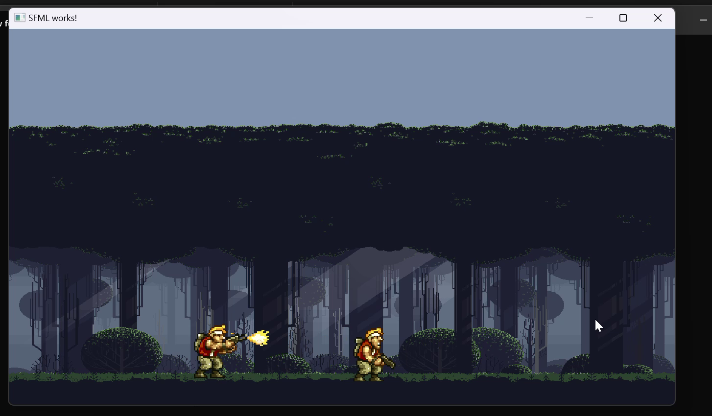

# For Complete Overview: https://youtu.be/HqlGr16vqQs?si=sTIVG4SLSfonA0ZE  

# it is made in Cmake make sure c++ development feature is installed in vs code community  
## download zip file and paste it in E local Disk "E:\New folder" this should be your folder path

# Controls:
  ## Right Arrow: Move Forward
  ## Left: Move Backward
  ## Down Arrow: Sit 

  ## Left Button MOuse: Fire
  
  # Enemy Dies after 10 bullets
## Drinking  

## Firing  

